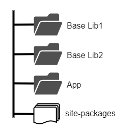

@title[Intro]

# conda
# &
# conda devenv

---

### What is conda?

*Package, dependency and environment management*

https://conda.io/miniconda.html

Note:
---

### Why Conda?

---

@title[pip hell]

`pip install numpy`


Note:
Trying t
pip doesn't have wheels. Nightmare to install vcredist. 
--- 

@title[Old Python dists]

Python distributions (the old way):
- Enthought |
- WxPython |
- Python(x,y) |
- Anaconda |

Note:
Anaconda started like a full dist
Distributions (in ESSS) also
---

## Conda

- No more "full dists"
- Pick only what you need
- Binaries ready to use, for most platforms
- https://conda.io/miniconda.html

Note:
Anaconda Repo
---

@title[Creating and activating]

```shell
> conda create -n mylib
> source activate mylib
> conda install pandas
```
@[1](Create a new environment)
@[2](Activate)
@[3](Install packages)

Note:
Package downloaded from Continuum
---
@title[Anaconda Packages]

https://anaconda.org/anaconda/repo

---
@title[Sharing Environments]

```shell
> conda list

> conda env export > environment.yml

> conda env create -f environment.yml
```

@[1](List installed packages)
@[3](Export to a env config file)
@[5](Create an environment based on env config)

Note:
Package downloaded from Continuum
Show and env.yml
---

@title[Install specific versions]

```shell
> conda create -n mypy27 python=2.7 numpy=1.11
Fetching package metadata .............
Solving package specifications: .

Package plan for installation in environment W:\conda-intro\envs\mypy27:

The following NEW packages will be INSTALLED:

    certifi:        2017.11.5-py27h03b45e1_0
    icc_rt:         2017.0.4-h97af966_0
    intel-openmp:   2018.0.0-hd92c6cd_8
    mkl:            2018.0.1-h2108138_4
    numpy:          1.11.3-py27hab9e983_3
    pip:            9.0.1-py27hdaa76b4_4
    python:         2.7.14-h8c3f1cb_23
    setuptools:     36.5.0-py27ha483b79_0
    vc:             9-h7299396_1
    vs2008_runtime: 9.00.30729.1-hfaea7d5_1
    wheel:          0.30.0-py27ha643586_1
    wincertstore:   0.2-py27hf04cefb_0
```

@[1]
@[2-22]

---

@title[Comparisson]

### conda x virtualenv

- conda manages python versions
- hardlink packages

---

### conda x pip

<ul>
<li>No compiler needed for C ext <span class="fragment">(before wheels)</span></li>
<li>Multiple version of binaries (cc flags, deppies)</li>
<li>Channels (Anaconda or private)</li>
<li>Dealt with non-python packages</li>
</ul>

Note:

---

## It gets better

---

## conda-forge

```
> conda config --add channels conda-forge
```

https://conda-forge.org/feedstocks/

Note:
Community effort to create a central channel for more packages
A little bureocratic, but this is for the better
(talk about the PiPy malicious packages)
---

## Working with Multiple Repos



Note:
- Why work with source (lib not mature, easier management, new dev incentive)
- Drawback (could become hight coupled)
---

## mu-repo
Multiple Git repos synch

```shell
> conda install mu_repo
> mu register myapp ../mylib1
```

Note:
Show mu commands (status, commit)
---

## Conda DevEnv

conda-env extension to work with multiple repos in dev mode

Note:
Live example
- show mylib
- try to use mylib (and fail)
- show what is a devenv.yml
- load the *myapp-devenv* environment

---

## Main Features:

---?code=sample.devenv.yml&lang=yaml

@title[conda-devenv features]

@[3-6](Include other environment files)
@[7-13](Jinja 2 support)
@[14-26](Define System variables)

Note:
in ESSS 10 levels 
---

@title[References]

- Conda, https://conda.io
- mu-repo, http://fabioz.github.io/mu-repo/
- conda-devenv, https://conda-devenv.readthedocs.io
- Fernandes, Filipe; *Community powered packaging: conda-forge*, PyCon 2017
- VanderPlas, Jake; *Conda: Myths and Misconceptions*, https://jakevdp.github.io/blog/2016/08/25/conda-myths-and-misconceptions/

---

@title[Thanks]

Thanks


<small>igor.ghisi(at)gmail</small>
